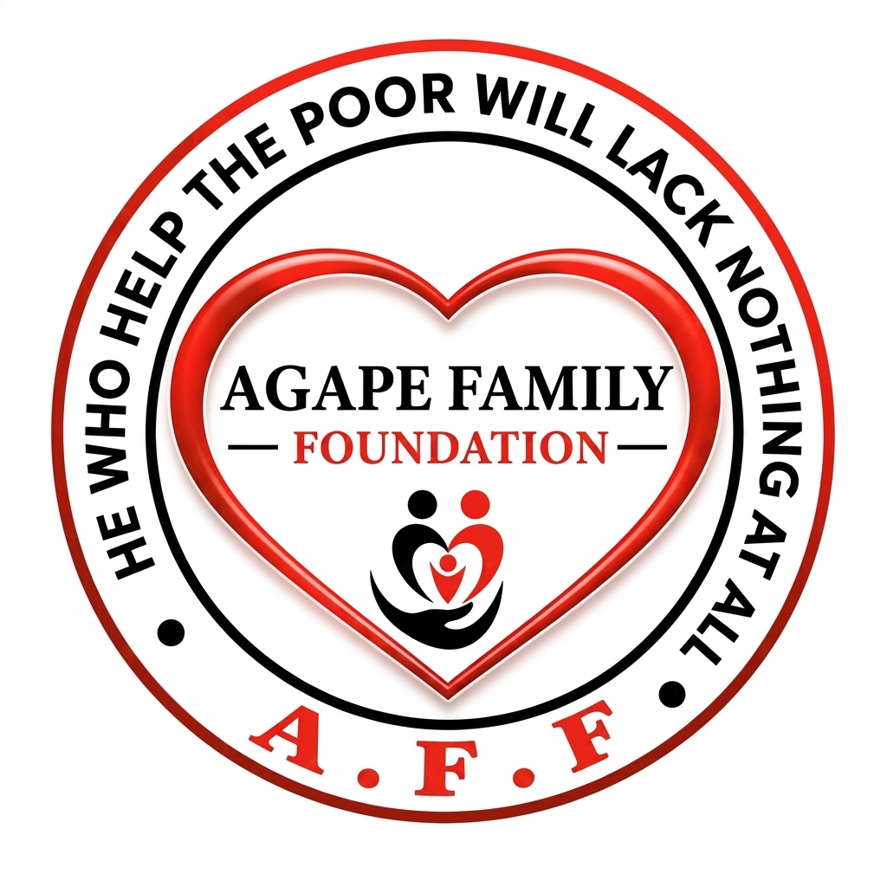

<div align="center">


<br/>



<br/>

[](https://git.io/typing-svg)

<p>


</p>

**A registered NGO in Tanzania, and the self-hosted website + admin platform that runs it.**
Every card, image, and figure you see on the public site is edited from a custom dashboard — no code, no developer, no build step, ever.

<a href="#features">Features</a> ·
<a href="#tech-stack">Tech Stack</a> ·
<a href="#getting-started">Getting Started</a> ·
<a href="#deployment">Deployment</a> ·
<a href="#honest-limitations">Limitations</a> ·
<a href="#license">License</a>

</div>

<br/>

## 🌍 About

> "He who helps the poor will lack nothing at all." — the words on the foundation's own emblem.

Agape Family Foundation has directly supported **520+ children** across Tanzania with education, healthcare, and daily care since 2022. This repository is the entire technical backbone of that work: a public website, a full admin dashboard, and everything in between — built to run on the cheapest possible server, forever, without needing a development team to maintain it.

<br/>

<a id="features"></a>
## ✨ Features

<table>
<tr>
<td width="50%" valign="top">

**🌐 Public website**
- 🇬🇧 🇹🇿 Instant English ⇄ Kiswahili switching, no reload
- 🖥️ **Server-rendered** — real content in the raw HTML, visible to search engines and AI crawlers that never run JavaScript
- 💳 Donate via M-Pesa, Tigo Pesa, Airtel Money & Halotel — copy-to-clipboard Lipa Namba, step-by-step instructions, self-reported payment confirmation
- 📣 Time-limited announcement pop-ups that self-delete on schedule
- 💬 WhatsApp "contact us" picker, admin-configurable
- 🍪 A cookie-consent banner that's actually respected by the analytics

</td>
<td width="50%" valign="top">

**🛠️ Admin dashboard**
- 🖼️ Full content control: hero, gallery, programs, leadership, blog, stories
- 🔐 Two-factor authentication (any standard authenticator app)
- 🔑 One-time passwords with forced change on first login
- 👥 Role-based staff accounts (up to 5), admin-initiated password reset
- 📉 Traffic chart & donation insights, right on the dashboard
- 🧹 Automatic image compression + orphaned-file cleanup, so storage never bloats
- 🧾 Full login history & failed-attempt log

</td>
</tr>
</table>

<br/>

<a id="tech-stack"></a>
## 🖥️ Tech Stack

<p align="center">


</p>

Plain Node.js — the built-in `http`, `crypto`, and `fs` modules do the heavy lifting. One real dependency: **[`sharp`](https://sharp.pixelplumbing.com/)**, used purely for server-side image re-compression. No React, no bundler, no database — content lives in a single, human-readable `data/content.json`.

This was a zero-dependency project by design: the whole app can be understood by reading its source, with nothing hidden behind a build step. `sharp` was the one deliberate exception, because getting genuinely smaller image files on disk needs real image-encoding logic Node has no built-in for.

<br/>

<a id="getting-started"></a>
## 🚀 Getting Started

```bash
git clone <this-repo-url>
cd agape-foundation
npm install

export ADMIN_PASSWORD="a-long-unique-password"
export SESSION_SECRET="$(openssl rand -hex 32)"

npm start
```

Then open:
- 🌐 `http://localhost:3000` — the public site
- 🔐 `http://localhost:3000/control` — the admin dashboard (username `admin`, the password above)

<details>
<summary><strong>⚙️ Environment variables</strong></summary>
<br/>

| Variable | Required | Description |
|---|---|---|
| `ADMIN_PASSWORD` | ✅ Yes | Password for the primary `admin` account. 12+ characters. |
| `SESSION_SECRET` | ✅ Strongly recommended | Fixed secret for signing session cookies. Unset ⇒ a random one is generated at startup, and **every restart logs every admin out**. Generate with `openssl rand -hex 32`. |
| `ADMIN_USERNAME` | Optional | Defaults to `admin`. |
| `PORT` | Optional | Defaults to `3000`. |
| `HOST` | Optional | Defaults to `127.0.0.1` — use a reverse proxy for public access. |

</details>

<br/>

<a id="deployment"></a>
## 📦 Deployment

Run this through Node — never deploy the HTML files to a static host, or the admin dashboard and content storage silently stop working.

1. Copy the project to your server, then `npm install` **on that server** (fetches the correct native `sharp` binary for its exact OS/architecture).
2. Put it behind a reverse proxy with HTTPS — required in production so session cookies can be marked `Secure`.
3. Run it as a persistent service. A ready-to-edit **systemd unit** is included at [`deploy/agape.service`](deploy/agape.service).

<details>
<summary><strong>🧭 Deploying under a subpath</strong> (e.g. alongside another site on the same server)</summary>
<br/>

See [`deploy/nginx-agape.conf`](deploy/nginx-agape.conf). The one easy-to-miss detail: it sets an `X-Forwarded-Prefix` header, which this app relies on to correctly prefix uploaded-image URLs and the session cookie path. Everything else already adapts automatically to whatever path it's served from.

</details>

<details>
<summary><strong>🩺 Diagnosing a deployment</strong></summary>
<br/>

The server prints diagnostics to its log on every boot — check these first if something looks wrong:

```bash
journalctl -u agape -f
```

It reports whether `data/content.json` exists, how many content keys loaded, and whether `data/` is writable. If admin login works but the dashboard shows no content, this log almost always has the answer.

</details>

<br/>

## 🗂️ Project Structure

```
├── server.js               Node HTTP server — routing, auth, content API, image storage, SSR
├── index.html               Homepage
├── pages/
│   ├── about · gallery · leadership · volunteer · contact · blog .html
│   ├── blog-post.html       Individual blog post detail page
│   ├── updates.html         Live announcements page
│   ├── login.html           Admin sign-in (supports 2FA)
│   └── admin.html           Admin dashboard  ("/control")
├── assets/
│   ├── js/site-data.js      Shared client logic: content loading, translations, cookie consent
│   └── uploads/             Admin-uploaded images (gitignore this in production)
├── data/content.json        All editable site content — back this up
├── robots.txt · sitemap.xml · llms.txt   Search & AI-crawler friendly, generated live
└── deploy/
    ├── nginx-agape.conf      Reverse-proxy config for subpath deployment
    └── agape.service         systemd service template
```

<br/>

<a id="honest-limitations"></a>
## ⚠️ Honest Limitations

No project is finished, and this README won't pretend otherwise.

- **Donations aren't automatically verified.** The Lipa Namba flow is manual — a donor pays via their own phone, entirely inside their mobile money provider's system, invisible to this website. The "I've sent my payment" form logs a *self-reported* declaration for admin reconciliation — it is not a payment confirmation.
- **Automated STK-push payment** needs a registered business account and live API credentials per provider. The UI and backend hook are built and ready; only the credentials are missing. By design, the PIN itself will never be entered on this website — that step belongs on the customer's own phone.
- Two-factor authentication is available but **off by default** — enable it from the Security panel.

<br/>

## 🤝 Contributing

Issues and pull requests are welcome. If you're changing anything content-rendering related, remember: the same templates currently exist in **two places** (`server.js` for server-rendering, `assets/js/site-data.js` for client-side updates without a reload) — keep them in sync.

<br/>

<a id="license"></a>
## 📄 License

*Add your chosen license here (e.g. MIT) before making this repository public.*

<br/>

<div align="center">


Made with 🧡 for the children of Tanzania.

</div>
